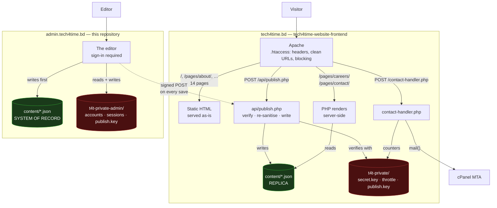
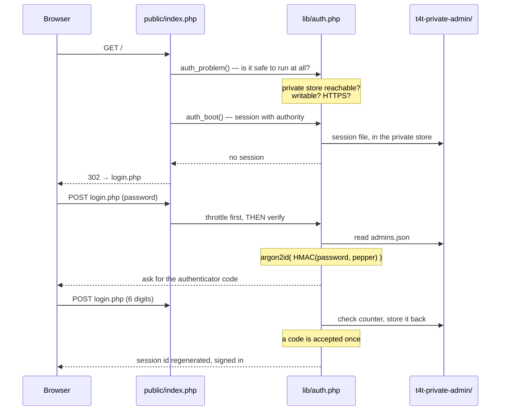
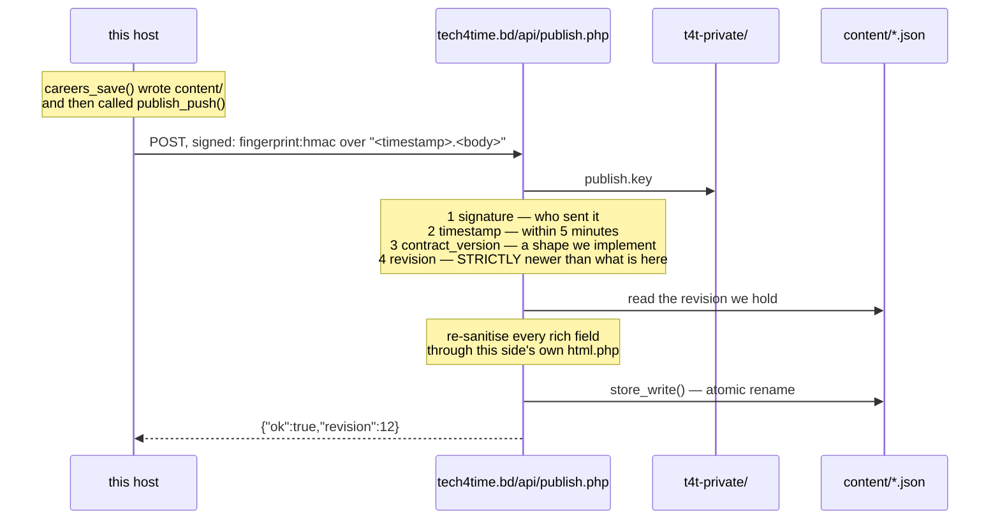
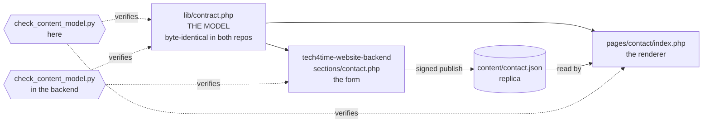

# Architecture

**Applies to:** both

How a request is served, where the data lives, and what talks to what. If you read one page before
touching the code, read this one.

---

## The whole picture



Three things carry the design.

**The green boxes are the content, and one of them is in charge.** The backend's copy is the system
of record and is written first; this site's is a replica it is *sent*. Editing the replica by hand
does not survive the next save in the admin.

**The dotted arrow goes one way, and only on a save.** The public site never calls the backend
during a request — not for content, not for the header, not for anything. That is
[0003](../90-decisions/0003-server-rendered-content.md) and
[0010](../90-decisions/0010-backend-pushes-content.md): a per-view API call would put indexability,
availability and 50–300 ms back into every page load.

**The red boxes are the secrets, and there are two of them.** Neither host can read the other's. The
public site holds no password hash and no name for a file that could contain one; the one value both
stores share is `publish.key`, which is what the dotted arrow is signed with.
[0017](../90-decisions/0017-two-private-stores.md)

---

## Serving a page

Six of them, all PHP, all behind the sign-in except the two that create it.

```
GET /?s=careers
  → public/index.php
      require lib/admin.php        the shell, and admin_require_auth()
        require lib/auth.php       session, account, second factor
        require lib/private.php    where the accounts are — outside the docroot
      require ../sections/careers.php
        require lib/careers.php    validation, and the save that publishes
          require lib/contract.php the shape, shared with the frontend
  → HTML, fully rendered, in one request
```

`admin_require_auth()` either returns the account or does not return at all: it redirects to the
sign-in, sends first-run visitors to setup, or refuses outright when the private store is missing or
the connection is not encrypted. Nothing in a section runs for a stranger.

**Every one of those requires reaches OUT of the document root.** `public/index.php` is inside it;
`lib/` and `sections/` are not, and no URL maps to them.
[0018](../90-decisions/0018-the-backend-serves-from-a-subdirectory.md)

### Signing in



The order in that diagram is load-bearing in two places:

- **`auth_problem()` runs before anything else.** If the private store is missing or unwritable, the
  admin refuses to load rather than proceeding. An editor that quietly works without a password is
  worse than one that visibly does not work at all.
- **The lockout is checked *before* the password is verified.** Otherwise "you are locked out" and
  "that password was wrong" take different amounts of time, and the difference tells an attacker
  which guesses were close.

Full design: [authentication.md](../10-development/server-side/authentication.md).

### Saving, which is also publishing

The record here is written **first**, and then pushed. If the push fails the edit is safe and can
be sent again; publishing first would mean a live site ahead of the thing it copies.



Each check answers something the others do not, and the fourth is the one that is easy to
under-rate:

- **The signature** proves the payload came from something holding the key. It proves nothing about
  whether the payload is *safe* — which is why every rich field goes back through this side's own
  `lib/html.php` afterwards. If the admin host were ever compromised, the public site should still
  not render script.
- **The timestamp** bounds how long a captured request stays useful. Five minutes either way,
  because the two clocks are different machines.
- **`contract_version`** refuses a document written in a shape this side does not implement, rather
  than writing one it would then mis-render.
- **The revision** is what actually stops a replay. Inside the five-minute window a captured request
  is signed perfectly well; it carries a revision the far side already holds, and a document must be
  **strictly newer** to be written. So the replay is a no-op instead of a rollback of the live site
  to whatever it said five minutes ago.

If any of them refuses, **the editor says so, in words, with a Publish again control.** Never a
silent gap: a save that appeared to work and did not arrive is the one failure nobody investigates,
because nothing asked them to. `tools/reconcile.py` covers the case where nobody was watching.
[publish-api.md](../10-development/server-side/publish-api.md)

---

## Where the data lives

```
/home/USER/                            cPanel account home — not served
├── public_html/                       ← DOCUMENT_ROOT   tech4time.bd
│   ├── index.html  pages/  assets/
│   ├── api/publish.php                the only thing here that writes
│   ├── lib/                           blocked by .htaccess
│   └── content/                       blocked by .htaccess
│       ├── careers.json               ← a REPLICA. api/publish.php writes it
│       └── contact.json               ← a REPLICA. api/publish.php writes it
├── admin.tech4time.bd/                tech4time-website-backend — see that repository
│   └── public/                        ← DOCUMENT_ROOT   admin.tech4time.bd
├── t4t-private/            0700       ← no URL maps here at all
│   ├── secret.key          0600       32 bytes; the throttle's keys derive from it
│   ├── throttle.json                  contact-form attempt counters
│   └── publish.key         0600       the SAME bytes as the backend's copy
└── t4t-private-admin/      0700       the backend's. Accounts, sessions, audit log
```

**Eight entries in this side's store, three in the other, and the asymmetry is the point.** Every
password hash, authenticator secret, recovery code and session on this project is in
`t4t-private-admin/` and nowhere else. The public site's store has three entries and no *name* for a
file that could hold an account — `T4T_PRIVATE_FILES` over there lists three things and
`t4t_private_path()` throws on a name it does not know, so there is no path on that host for a
credential to be written to at all. [0017](../90-decisions/0017-two-private-stores.md)

The two master keys are unrelated, deliberately: the halves are meant to end up on different
machines, and on that day the frontend must run with no access to any of this.

**On this host, protection is the layout rather than a rule:**

| | Protected by | If that fails |
|---|---|---|
| `content/` — the system of record | **not being inside the document root** | — there is no request that reaches it |
| `t4t-private-admin/` | **not being inside the website, or the repository** | — likewise |

The document root is `public/`, so neither has a URL. That is stronger than an `.htaccess` rule,
which is a policy the server chooses to apply and stops applying silently if `mod_rewrite` is off or
an upload replaces the file. See
[0008](../90-decisions/0008-private-store-outside-docroot.md) and
[0018](../90-decisions/0018-the-backend-serves-from-a-subdirectory.md).

> The public site is the half that does rely on `.htaccess` rules, for its `content/` replica and
> its `lib/`. That is the right protection for site copy — if it failed, a stranger would read the
> office addresses the contact page already shows them.

The backend goes one step further and puts `lib/`, `sections/` and `content/` outside its document
root too, so none of them depends on a rule at all —
[0018](../90-decisions/0018-the-backend-serves-from-a-subdirectory.md).

---

## The content contract

The one invariant that keeps the editor and the page from drifting apart:



**The page renders straight from the JSON**, so there is no second copy of the structure to keep in
step. Add a field and three things must move together: the model, the form and the renderer.

**The model is the shared file**, and that is what makes the two halves add up. `lib/contract.php`
is byte-identical in both repositories, so neither can change the shape without the other; each then
checks its own side against it. `check_content_model.py` says which half it ran and names the
repository that does the other, rather than quietly checking less than it used to.

The careers page has the same three layers and is proved differently, because both of its sides
consume their fields in a loop and a regex over the source reads the loop variable rather than the
fields. Here, `test_publish.py` sends a marker through every field the model declares and requires
it back off the public page; the backend's `test_careers_admin.py` walks the editor half.

Full walkthrough, including which page gets which check and why:
[content-model.md](../10-development/server-side/content-model.md).

---

## What runs in the browser

Nothing is required. Everything degrades.

```
theme-init.js     ← the ONLY synchronous script, in <head>: which theme to paint

… page renders …

admin-nav.js      ← the rail's narrow/wide control, and closing the account menu
editor.js         ← the rich-text toolbar over a contenteditable surface
admin-outline.js  ← marks which band you are in, in the "On this page" column
admin-swap.js     ← puts a screen in place of the one on show; wires the links
admin-toast.js    ← lifts what the server said into the corner of the page
admin-dialog.js   ← the admin's own question box, instead of window.confirm()
admin-forms.js    ← posts the editors without navigating, and puts the answer back
theme-toggle.js   ← the theme switch
admin-init.js     ← runs last, calls each init() in a try/catch
```

**That last line was not true until it was checked.** The calls were bare, so
anything thrown by one module stopped every module after it — and the order is
the order of dependence, which made it the worst possible arrangement: a throw
in the rich-text editor left the forms and the links unwired and every one of
them a full page load, with nothing on screen to say why. Each `init()` is
called in its own `try` now, and a failure is reported to the console and
stepped over.

Without JavaScript the rail stays wide and fully labelled — at whatever width the cookie says, see
below — the account menu is a `<details>` the browser opens by itself, every form navigates and
every link follows the way it always did, the theme follows the operating system, and the rich-text
fields are plain `<textarea>`s that save exactly what is typed. **Every editor still works.**

`admin-swap.js` and `admin-forms.js` are worth understanding, because they look like the kind of
thing that usually introduces a second truth. They do not. Both request the same URL the browser
would have requested, follow the redirect the way the browser would, and put the returned markup
back in place. There is no JSON endpoint, no partial-render path and no server-side branch —
**nothing on the server knows or cares whether the request came from one of them.**

They differ only in what is replaced and what that means for history:

| | replaces | history | why |
|---|---|---|---|
| `admin-forms.js` | `#admin-main` | `replaceState` | the bar holds the status line the post has just written to, and a save is not a place to press Back to |
| `admin-swap.js` | `#admin-body` | `pushState` | the bar's title, lede and Save button all belong to the screen, and moving between screens is exactly what Back is for |

**The Save button is outside what `admin-forms.js` replaces, and that has bitten once.** It sits in
the title bar, above `<main>`, reaching its form through the HTML `form=` attribute — so a post
that disables it against a double-press must re-enable it by hand. Every other submitter is inside
`#admin-main` and arrives fresh from the swap, which is why a disable that was never undone looked
like it worked everywhere: it did, except on the one button somebody presses first. `idle()` in
`admin-forms.js` now runs on every path out, and `test_admin_forms.py` presses Save twice without
reloading.

**And where it posts is read off the prototype, which has bitten harder.** A form's named controls
hide the form's own DOM properties — `HTMLFormElement` is `[LegacyOverrideBuiltIns]` — so on the
careers screen, whose every form carries `<input name="action">` because the section reads
`$_POST['action']`, `form.action` was that input rather than a URL. `fetch()` posted to
`/[object%20HTMLInputElement]` and both hosts answered 404 to saving, publishing, unpublishing,
reordering and deleting alike, for ten days, while every suite stayed green: the markup was correct
throughout, and nothing but this file ever read a property off a form. It reads through
`HTMLFormElement.prototype` now, `tools/check_form_dom.py` refuses the pattern in both halves, and
`test_admin_forms.py` asks the module for the address it would post each form to on every screen —
then presses a careers button for real.
[ADR 0022](../90-decisions/0022-form-properties-are-read-off-the-prototype.md)

Neither touches the rail. It is the same markup on every screen bar one attribute, so `admin-swap.js`
brings `aria-current` across and leaves the element standing — which is what keeps the account
menu's open state, the rail's own scroll position, and the width somebody chose. The rail being
rebuilt on every navigation is what used to make it flash open and shut on the way to the page you
asked for.

**The width is a cookie, and that is a decision, not an accident.** It was `localStorage`, read by
`admin-nav.js` — a deferred script, which by definition runs after the document is parsed and often
after it is painted. So a narrow rail was drawn wide and then snapped shut, every load. `t4t_rail`
travels with the request, so `admin_rail_state()` writes `data-rail` before it writes the rail and
the first frame is already right. Nothing in the application branches on the value; it is a width.

What all of this buys is that pressing "Move down" on the fiftieth technology logo leaves you
looking at the fiftieth technology logo instead of the top of a quarter-megabyte form, and that
moving from Contact to Careers moves the page rather than the whole window. Deleting either file
restores the old behaviour exactly.

**What the server said is shown in the corner, not at the top.** Every editor
is several screens long, so a confirmation printed at the top of the document
is a confirmation nobody sees — and reaching it was, for a while, the reason
the page appeared to reload after every press. The server still renders that
paragraph exactly where it always did, so it is there with no JavaScript at
all; `admin-toast.js` lifts it out of the page and slides it up in the corner.
Error lists and standing advisories are deliberately left where they are: one
is a list of fields to go and fix, the other is a condition of the page, and
neither is something that should fade out after four seconds.

**Questions are asked in the page's own `<dialog>`.** `window.confirm()` is
drawn by the browser, never learned this theme, and in several browsers prints
the site's own domain above the question as though the page were something to
be wary of. `admin-dialog.js` builds a `<dialog>` and calls `showModal()`, so
the focus trap, Escape, inertness and the backdrop are the browser's — what is
ours is the markup, the wording and the blur. It is asynchronous where
`confirm()` was not, which is why every caller reads as "ask, then act".

**Unsaved work is guarded in three places, because there are three ways out.**
Following a link is asked about in the click handler; Back and Forward are asked about in
`popstate`, which has to put the entry back with `history.go()` because by then it has already
moved; and a reload, a closed tab or a sign-out is asked about by `beforeunload`, whose wording
belongs to the browser and cannot be ours. All three read the same flag — set by typing anywhere in
`#admin-main`, and by any post that was not a save, since a row that has been added lives in the
form and nowhere else until Save is pressed. None of them fires on an untouched screen: a page that
asks on every exit is a page people learn to click through.

**A new editor gets this for free, and must not opt out of it.** Give the form `data-async` and
write every link between screens as `?s=<section>` on the admin's own path. `test_admin_forms.py`
walks every screen and fails on a link that is none of: an in-page anchor, another origin,
`target="_blank"`, or a `?s=` on this path — the four things that are either handled or plainly not
meant to be.

`editor.js` is a surface over the textarea, not a replacement for it — the hidden
field is what posts, and `test_editor.py` asserts the two stay in step.

Alignment is a **class**, never an inline style: the CSP is `style-src 'self'`, so a `style=`
attribute would be refused by the browser and silently lost. `test_editor.py` and
`test_contact_admin.py` both check that.

---

## What is not built

**The four accessibility crawlers never covered the admin.** `check_focus.py`,
`check_dark_mode.py`, `check_responsive.py` and `check_hover.py` walk a list of public pages and
never signed in, so they missed these screens before the split as well as after it. They went to
`tech4time-website-frontend` with the pages they were written for; adapting them to the admin's signed-in
screens is outstanding, and named here rather than left to be discovered.

The split itself is done: [0010](../90-decisions/0010-backend-pushes-content.md),
[0011](../90-decisions/0011-two-repositories.md), [0017](../90-decisions/0017-two-private-stores.md)
and [0018](../90-decisions/0018-the-backend-serves-from-a-subdirectory.md) are all built, and the
sequence diagram above is the running code rather than a plan.
